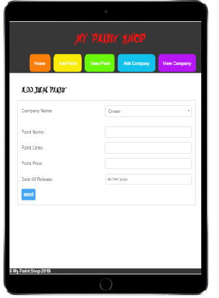
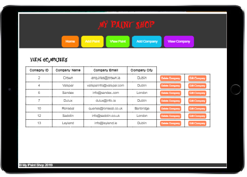

# My Paint Shop

My website is designed to store information on paint objects that each company stored in the company table in the database provides.

## Table of contents

- [Introduction](#Introduction)
- [Project Features](#project-features)
- [Improvements](#improvements)
- [Application](#application)
- [References](#references)

## Introduction

The user will be able to add new companies, edit, view and also delete them. As the company table has a one to many relationship with the paint table. The companyID is a foreign key in the paint table, therefore user can only assign a company to a paint if the company already exists. The user can add,delete,view and update a paint object.

I believe I have implemented most of the compulsory functionality as requested. Please see the features I have implemented below.

## Project Features

- Create/Read/Update/Delete a paint object in the database
- Create/Read/Update/Delete a company object in the database
- Applied the MVC Pattern as I have a model class for both my paint and company tables
- Used two linked tables with a one to many relationship and I implemented a join in my SQL tables to retrieve company name instead of displaying company id:
  `SELECT .... From paint INNER JOIN company on paint.companyID= company.companyID;`

## Improvements

There was some features which I would have wished to implement if I had more time:

1. On update the data entered by the user should still be stored in the form if they make a mistake.
2. Set up a colour image so the user can see what colour they are viewing or adding.
3. I could also have a companies menu where I click on each company and only see the paints belonging to that company.
4. I also wish I could've displayed a Euro symbol in from of my prices in the paint views. I had tried the following code which didn't work for me: `$price = "&euro;".number_format(($paint['paintPrice']),2);`

## Application

The two images below show my view and add pages. One in portrait view the other in landscape view:

## References

- My website has been hosted remotely and can be found at https://ca3cunnighamaisling.000webhostapp.com/
- My lecturer Shane Gavin has provided a starter project on this link :https://gitlab.comp.dkit.ie/gavins/ rapid-starter-project/ as built in class
- Shane also gave me access to his videos on YouTube. I watched them in order to understand how to get request data from a form. This is the link: https://www.youtube.com/watch?v=G-A1xizeEPA&feature=youtu.be
- Rachel Callaghan helped me understand how to retrieve the CompanyName from the CompanyID and how to use the Select option input in a form.
- James Farrell helped me in the ITLC when I had an issued with my parameterised query.
- I also watched Shane's YouTube Video on retrieving data from query string with the link: https://www.youtube.com/watch?v=s-N7aMnRCxY&feature=youtu.be.
- I re-used the base of my FormUtils file from my last CA, I have edited to do the validation and sanitization of values in my add and edit forms.
- Stack overflow to help with my date validation check to ensure the user has enetered a date before todays date. The page that helped me can be found here: https://stackoverflow.com/questions/32642417/php-date-time-greater-than-today.
